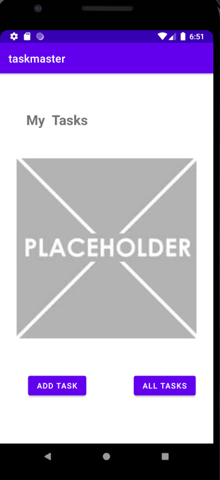
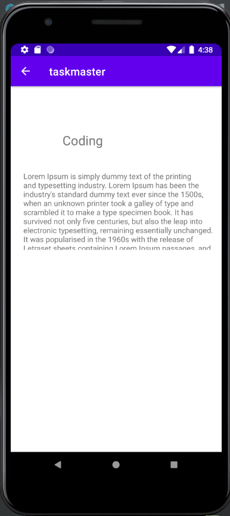
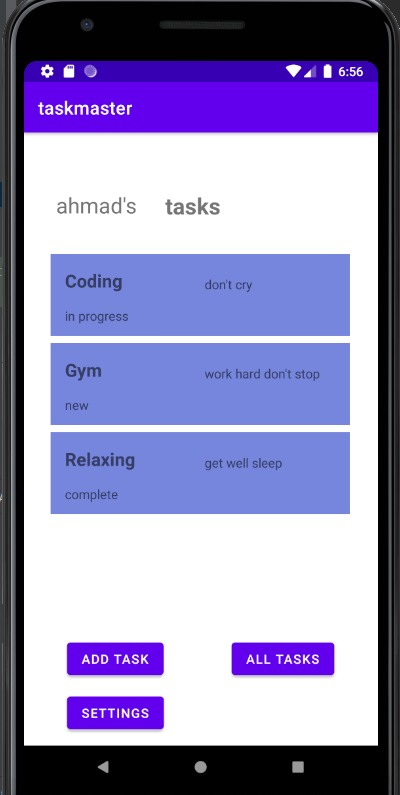

# taskmaster

## lab26
there is three Activities :
* Main that include placeholder and 2 button first one navigate you to the add task activity
and second button navigate you to the all task activity.

* Add task activity : that has a to field and add task button that just show add task label when you click it

* All task activity : that has placeholder 

## lab27
I added two more  Activities :
* Task detail that provide the task title that coming from home page when user click one the task button
  
* Setting : that provide a field and submit button , when user submit user name in field it will  provide in home page

## lab28

* Today, you’ll refactor your homepage to look snazzy, with a RecyclerView full of Task data
* Refactor your homepage to use a RecyclerView for displaying Task data.

## lab29

* added room to the program so the data saved in mobile storage 
* you can add task from add task activity

##lab32

* put aws nested of room in my program
* add task to the database
* get all task from database

##lab33

* add team to the app
* provide the task in main related to user team 

##lab36

* add authorization to the app